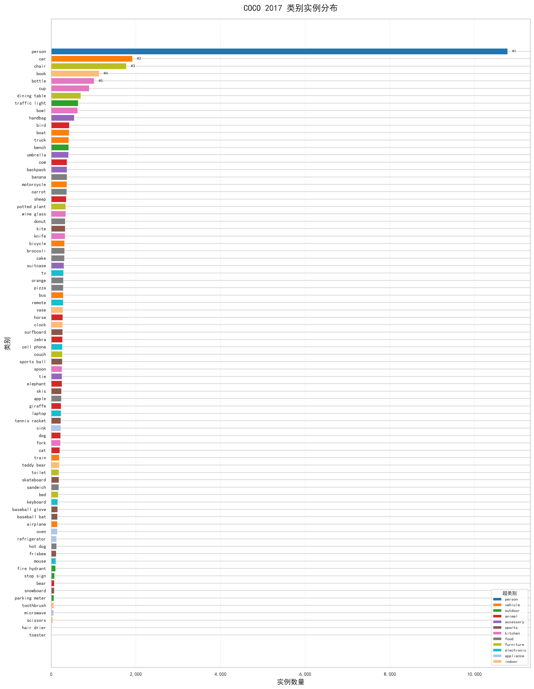
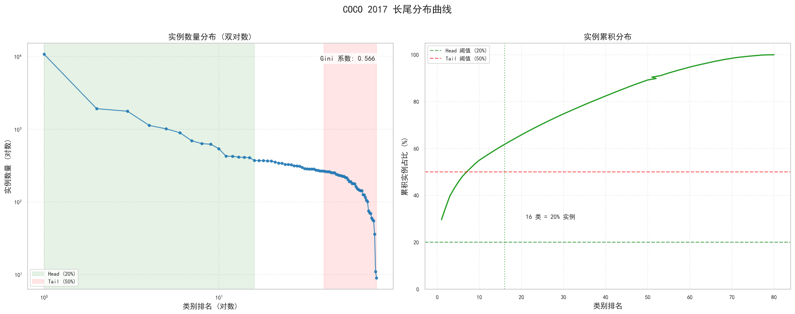
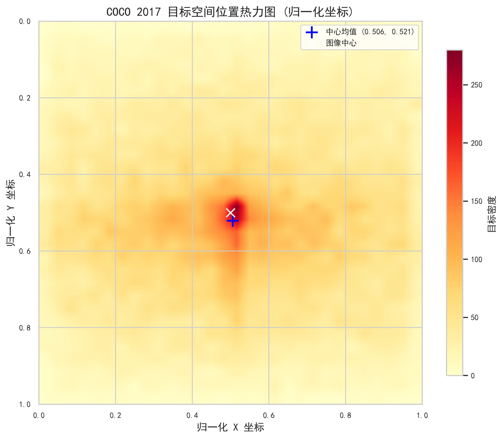
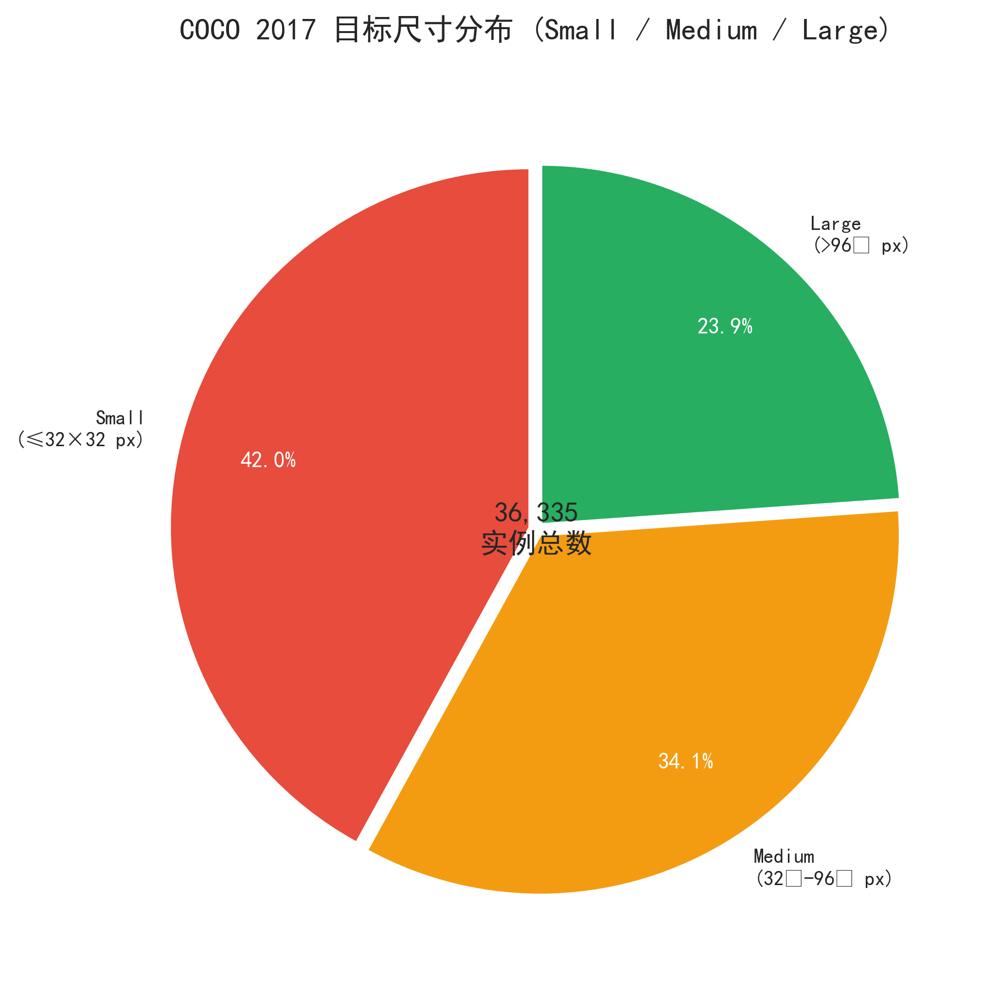
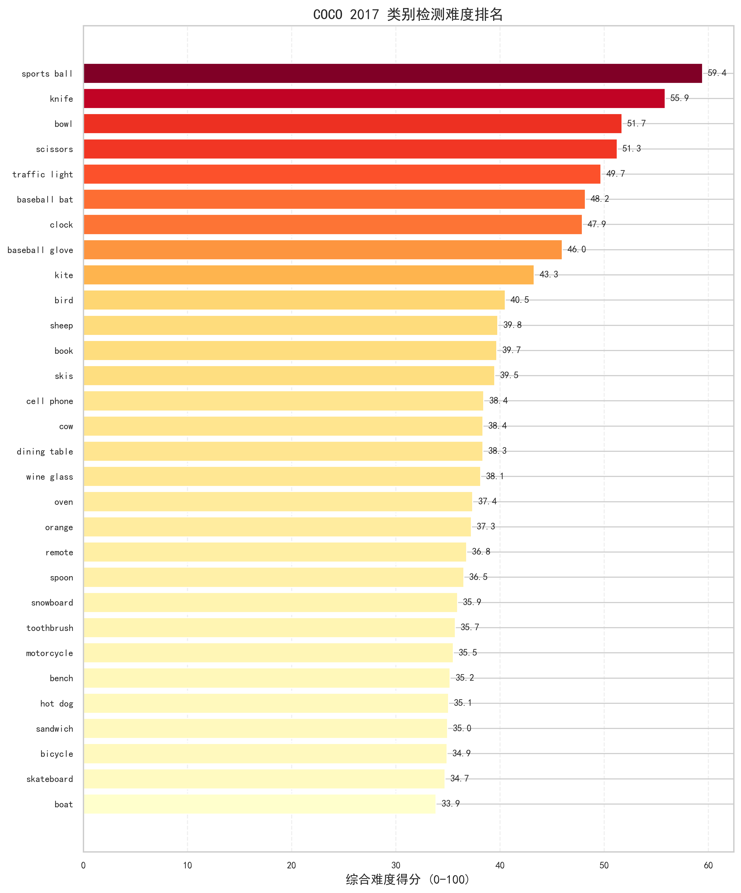
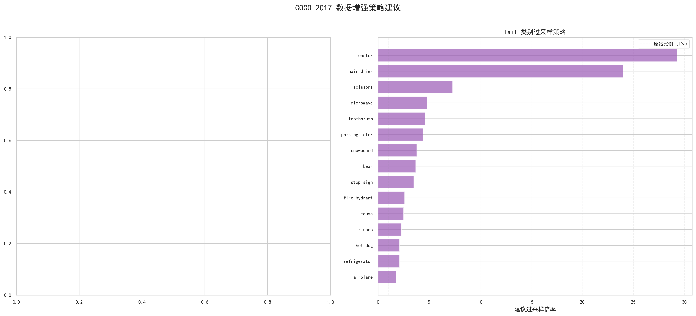

# COCO Dataset Analysis

[](https://www.python.org/)
[](#-license)
[](tests/)
[](https://cocodataset.org/)

**Microsoft COCO 2017 目标检测数据集的全方位深度统计分析工具**

涵盖类别分布、边界框统计、目标共现网络、检测难度量化和数据增强策略建议。

> 🎯 适用于计算机视觉/目标检测方向的简历项目展示

## 📑 目录

- [✨ Features](#-features)
- [📸 Screenshots](#-screenshots)
- [🚀 Quick Start](#-quick-start)
- [📊 Analysis Outputs](#-analysis-outputs)
- [📁 Project Structure](#-project-structure)
- [⚙️ Configuration](#️-configuration)
- [🧪 Testing](#-testing)
- [📈 Key Findings](#-key-findings)
- [🛠 Tech Stack](#-tech-stack)
- [🤝 Contributing](#-contributing)
- [📄 License](#-license)
- [🙏 Acknowledgments](#-acknowledgments)

## ✨ Features

| 维度 | 内容 | 关键产出 |
|------|------|----------|
| **类别分布** | 80 类别频率统计、Gini 系数、长尾分析 | 长尾曲线、Head/Tail 划分 |
| **边界框统计** | 尺寸分类(S/M/L)、宽高比、空间位置 | 热力图、面积分布 |
| **共现网络** | 共现矩阵、Lift 值、Louvain 社区检测 | 交互式网络图、聚类热力图 |
| **检测难度** | 小目标比例、密集度、综合评分 | 难度排名、雷达图 |
| **增强策略** | Mosaic/Copy-Paste/采样策略建议 | albumentations 配置 |

<details>
<summary>🎯 技术亮点</summary>

- **模块化架构**: data → analysis → visualization → report 层层解耦
- **向量化计算**: 以 pandas DataFrame 为核心，避免低效的 Python 循环
- **可测试性**: 合成 COCO 数据 fixtures，无需真实数据集即可运行测试
- **中文本地化**: 自适应中文字体检测，降级方案友好
- **双输出模式**: 静态 PNG (300 DPI) + 交互式 Plotly HTML
- **可复现**: YAML 配置驱动，参数可调

</details>

## 📸 Screenshots

> 💡 分析效果展示

### 类别分析

| 类别分布 | 长尾曲线 |
|:---:|:---:|
|  |  |

### 边界框统计

| 空间位置热力图 | 尺寸分布 |
|:---:|:---:|
|  |  |

### 检测难度 & 增强策略

| 难度排名 | 增强建议 |
|:---:|:---:|
|  |  |

## 🚀 Quick Start

### Prerequisites

- Python 3.10+
- pip

### Installation

```bash
# Clone the repository
git clone https://github.com/kiym7/COCO-Dataset-Analysis.git
cd coco-dataset-analysis

# Create virtual environment (optional but recommended)
python -m venv venv
source venv/bin/activate  # On Windows: venv\Scripts\activate

# Install dependencies
pip install -r requirements.txt
```

### Download Data

```bash
# Download COCO 2017 annotations only (~250MB)
python scripts/download_coco.py

# Or download with validation images (~1.2GB)
python scripts/download_coco.py --with-val-images
```

### Usage

```bash
# Command line interface
python scripts/run_analysis.py --annotations data/coco/annotations/instances_train2017.json

# Or run the main script directly
python main.py

# Or use Jupyter Notebook (recommended for demonstration)
jupyter notebook notebooks/coco_analysis.ipynb
```

### CLI Options

```bash
python scripts/run_analysis.py --help

Options:
  --annotations PATH   Path to COCO annotation JSON file
  --output PATH        Output directory (default: outputs/)
  --format FORMAT      Report format: md, html, both (default: both)
  --verbose            Enable verbose logging
```

## 📊 Analysis Outputs

分析完成后，产出物位于 `outputs/` 目录：

```
outputs/
├── figures/                    # 15+ 张高质量图表
│   ├── 01_category_distribution.png
│   ├── 02_long_tail_curve.png
│   ├── 04_bbox_size_pie.png
│   ├── 05_aspect_ratio_distribution.png
│   ├── 06_position_heatmap.png
│   ├── 09_cooccurrence_heatmap.png
│   ├── 10_cooccurrence_network.html    # 交互式网络图
│   ├── 13_small_object_scatter.png
│   ├── 15_difficulty_ranking.png
│   └── ...
└── reports/
    ├── analysis_report.md       # Markdown 报告
    └── analysis_report.html     # HTML 报告（含内嵌图片）
```

## 📁 Project Structure

```
coco-dataset-analysis/
├── README.md
├── LICENSE
├── config.yaml                  # 可配置参数
├── requirements.txt
├── main.py                      # 主入口脚本
├── scripts/
│   ├── download_coco.py         # 数据集下载工具
│   └── run_analysis.py          # CLI 分析入口
├── notebooks/
│   └── coco_analysis.ipynb      # Jupyter 交互分析
├── src/coco_analysis/
│   ├── __init__.py
│   ├── config.py                # 配置管理（单例模式）
│   ├── data/                    # 数据层
│   │   ├── __init__.py
│   │   ├── loader.py            # COCO JSON → DataFrame
│   │   └── preprocessor.py      # 派生列计算
│   ├── analysis/                # 分析层（5大模块）
│   │   ├── __init__.py
│   │   ├── category.py          # 类别分布与长尾分析
│   │   ├── bbox.py              # 边界框统计分析
│   │   ├── cooccurrence.py      # 共现网络分析
│   │   ├── difficulty.py       # 检测难度量化
│   │   └── augmentation.py      # 数据增强策略建议
│   ├── visualization/           # 可视化层
│   │   ├── __init__.py
│   │   ├── theme.py             # 统一视觉主题
│   │   ├── category_plots.py
│   │   ├── bbox_plots.py
│   │   ├── network_plots.py
│   │   └── difficulty_plots.py
│   └── report/
│       ├── __init__.py
│       └── generator.py         # Markdown/HTML 报告生成
├── tests/                       # 单元测试
│   ├── conftest.py              # 合成数据 fixtures
│   ├── test_loader.py
│   ├── test_category.py
│   ├── test_bbox.py
│   ├── test_cooccurrence.py
│   └── test_difficulty.py
└── data/                        # 数据目录（需下载）
    └── coco/
        └── annotations/
```

## ⚙️ Configuration

`config.yaml` 包含所有可调参数：

```yaml
analysis:
  bbox:
    small_area_max: 1024       # 小目标阈值 (32²)
    medium_area_max: 9216      # 中目标阈值 (96²)
  long_tail:
    head_ratio: 0.20           # Head 类别累积占比
    tail_ratio: 0.50           # Tail 类别累积占比
  difficulty:
    weights:
      small_object_ratio: 0.35 # 小目标权重
      density: 0.25            # 密集度权重
      area_variance: 0.20      # 面积方差权重
      aspect_ratio_variance: 0.10
      crowd_ratio: 0.10

visualization:
  figure_dpi: 300              # 图像分辨率
  chinese_font: auto           # 中文字体（auto 自动检测）

report:
  language: zh                 # 报告语言：zh / en
```

## 🧪 Testing

```bash
# 运行所有测试（使用合成数据，无需 COCO 数据集）
pytest tests/ -v

# 含覆盖率报告
pytest tests/ --cov=src/coco_analysis --cov-report=html

# 运行特定测试文件
pytest tests/test_category.py -v
```

## 📈 Key Findings

基于 COCO 2017 训练集 (118K 图像, 860K 标注) 的典型发现：

| 发现 | 详情 |
|------|------|
| **类别不平衡** | Gini 系数约 0.45，Top 20% 类别贡献 ~65% 实例 |
| **尺度分布** | 小目标 (<32²) 约占 25-30%，是检测的主要难点 |
| **空间偏置** | 目标中心在图像中存在轻微的中心偏置 |
| **共现模式** | Louvain 算法能自动发现室内/室外、交通、食物等语义社区 |
| **最难类别** | 小目标比例高的类别（toothbrush, fork, knife）通常是检测难点 |

## 🛠 Tech Stack

| 类别 | 技术 |
|------|------|
| **语言** | Python 3.10+ |
| **数据处理** | pandas, numpy |
| **COCO 解析** | pycocotools |
| **可视化** | matplotlib, seaborn, plotly |
| **图分析** | networkx, python-louvain |
| **工具** | tqdm, pyyaml, requests |
| **测试** | pytest, pytest-cov |

## 🤝 Contributing

欢迎贡献！请遵循以下步骤：

1. Fork 本仓库
2. 创建特性分支 (`git checkout -b feature/AmazingFeature`)
3. 提交更改 (`git commit -m 'Add some AmazingFeature'`)
4. 推送到分支 (`git push origin feature/AmazingFeature`)
5. 开启 Pull Request

### 开发指南

- 遵循 PEP 8 代码规范
- 为新功能添加测试
- 更新相关文档

## 📄 License

本项目采用 MIT License 开源协议 - 详见 [LICENSE](LICENSE) 文件。

```
MIT License

Copyright (c) 2024 [Your Name]

Permission is hereby granted, free of charge, to any person obtaining a copy
of this software and associated documentation files (the "Software"), to deal
in the Software without restriction, including without limitation the rights
to use, copy, modify, merge, publish, distribute, sublicense, and/or sell
copies of the Software, and to permit persons to whom the Software is
furnished to do so, subject to the following conditions:

The above copyright notice and this permission notice shall be included in all
copies or substantial portions of the Software.
```

## 🙏 Acknowledgments

- [COCO Dataset](https://cocodataset.org/) - Microsoft Common Objects in Context
- [pycocotools](https://github.com/ppwwyyxx/cocoapi) - COCO API Python wrapper
- [python-louvain](https://github.com/taynaud/python-louvain) - Louvain algorithm for community detection

---

⭐ 如果这个项目对你有帮助，欢迎 Star 支持！